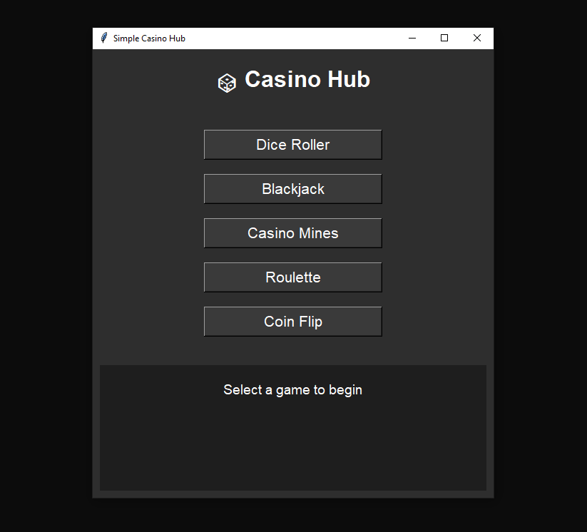

# 🎲 Casino Hub

A sleek and professional Python Tkinter application featuring multiple classic games in one place!  
Enjoy Dice Rolling with ASCII art, Blackjack, Casino Mines, Coin Flip, and more — all in a clean, easy-to-use GUI.

---

## Features

- **Dice Roller**: Roll various dice (D4, D6, D8, D10, D12, D20) with cool ASCII art and roll multiple dice at once.
- **Blackjack**: Fully functional Blackjack game with dealer AI and game status updates.
- **Casino Mines**: A simple minesweeper-style game with score tracking and intuitive UI.
- **Coin Flip**: Flip a coin with animation and fun emoji results.
- **Roulette**: Placeholder for future implementation.

---

## Screenshots

   

## Installation

1. Clone this repository:

   ```bash
   git clone https://github.com/Jcreeper23/Simple-Casino.git
   cd Simple-Casino
